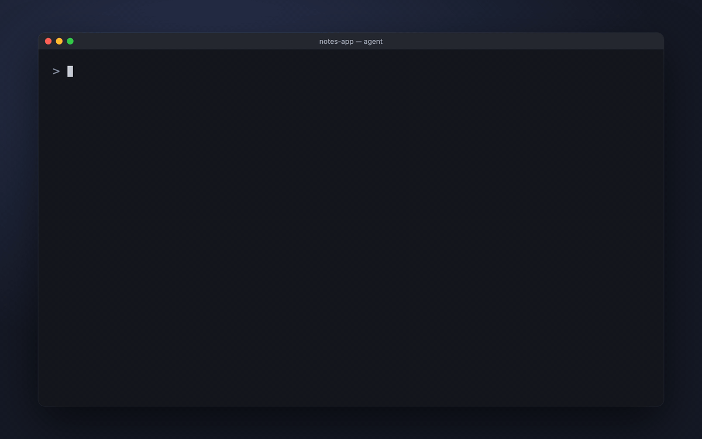
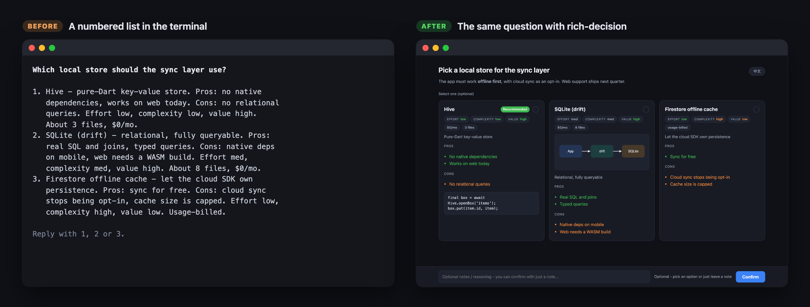
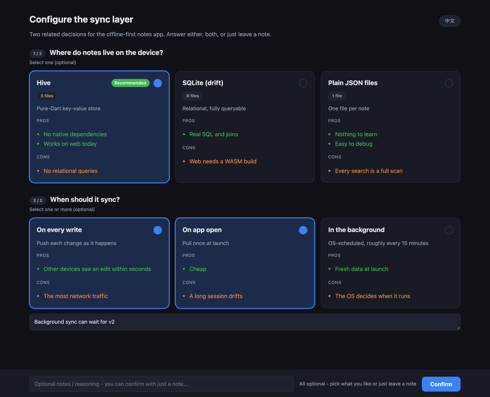
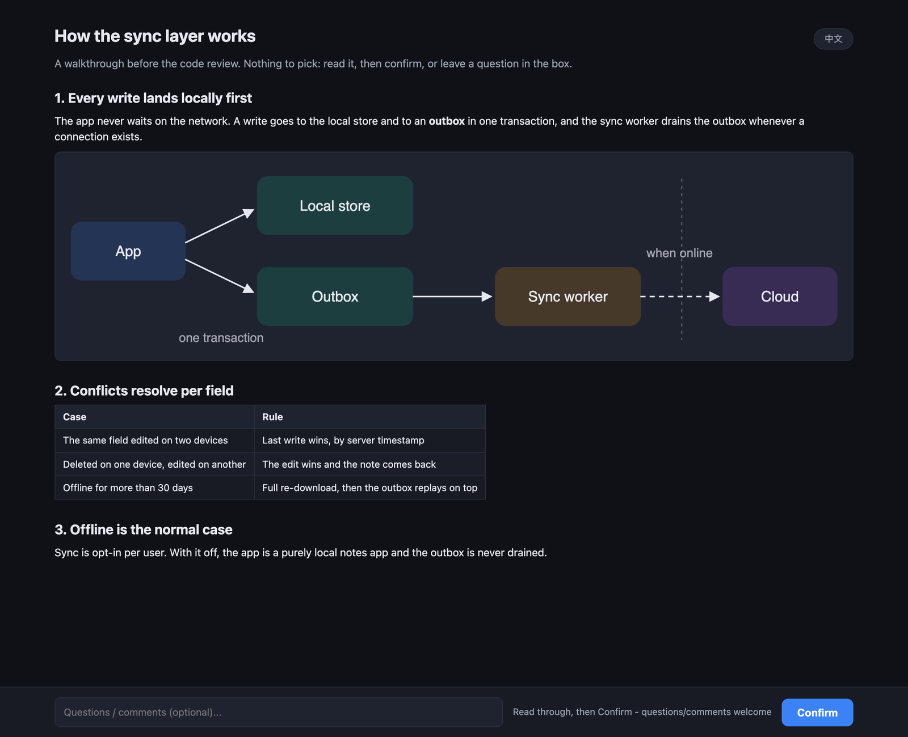
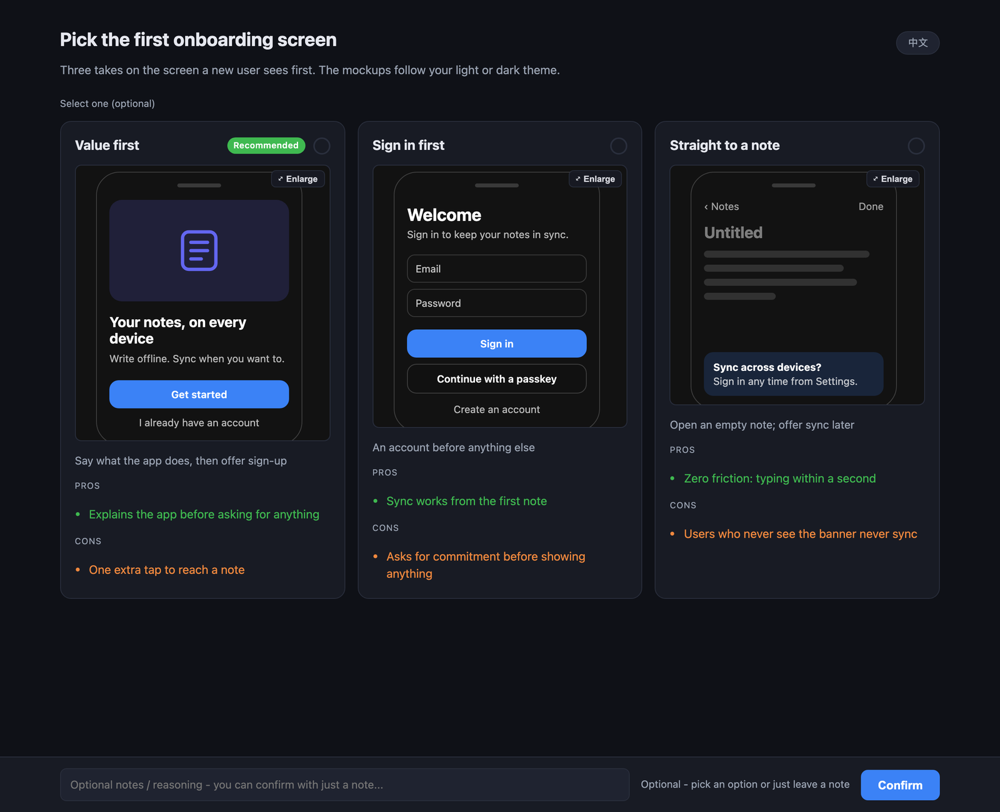
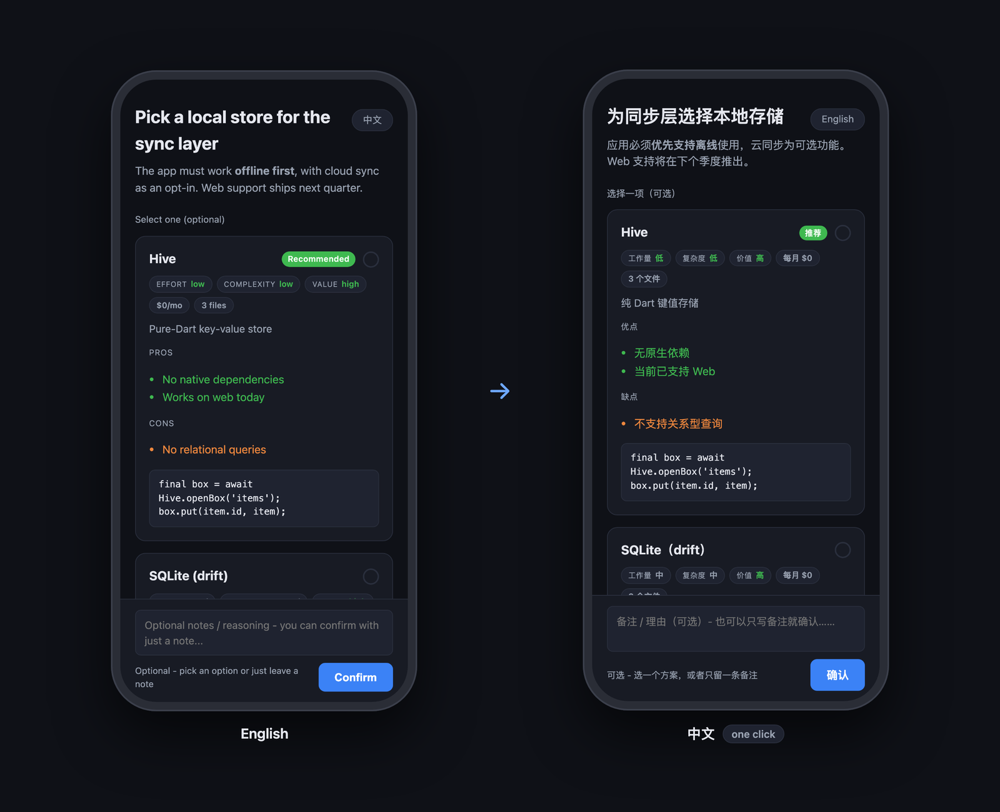

# rich-decision

**Let your coding agent ask you questions with a real UI instead of a numbered list in the
terminal.**

An [agent skill](https://code.claude.com/docs/en/skills) for Claude Code (and Codex). When
the agent has a choice for you to make, it writes a small JSON spec. The skill serves a
local page with comparison cards, pros and cons, code previews, diagrams and mockups, opens
it in a popup window, and hands your pick back to the agent as JSON.



## Why

A terminal is a poor place to compare three architectures, judge a UI mockup or triage ten
ideas. The built-in question tool shows labels and a monospace preview. This shows the
actual mockup, side by side, and lets you answer with a note as well as a click.



## What it can show

<table>
<tr>
<td width="50%" valign="top">

<br><b>Several questions on one page</b>, single- or multi-select, with an optional notes
box per question.
</td>
<td width="50%" valign="top">

<br><b>Explainer pages</b>: sections of markdown, tables and diagrams with no options, for
"here is how this works". Your questions come back as notes.
</td>
</tr>
<tr>
<td width="50%" valign="top">

<br><b>UI mockups</b> in real HTML and CSS, sandboxed, with an Enlarge button. They follow
your light or dark theme.
</td>
<td width="50%" valign="top">

<br><b>Your language, on your phone</b>: one click translates the page into your second
language, and the page is also served on your LAN, so a phone mockup can be judged on a
phone.
</td>
</tr>
</table>

And on every page:

- **Comparison cards**: summary, pros/cons, effort/complexity/value chips, fact chips, a
  "Recommended" badge.
- **Visuals on any card**: inline SVG, Mermaid, sandboxed HTML/CSS mockups, images, video.
- **No dependencies**: Python standard library, one vendored copy of `marked`, no build
  step. Works offline; only Mermaid diagrams load from a CDN, and fall back to their source
  without one.
- **A real window on macOS**: a native WebKit popup with its own Dock icon, compiled on
  first use when Xcode or the Command Line Tools are installed. Elsewhere it opens a browser
  tab.

## Install

Claude Code, for every project:

```bash
git clone https://github.com/kouxing2000/rich-decision ~/.claude/skills/rich-decision
```

For one project only, clone it into that project's `.claude/skills/rich-decision`
instead. For another agent that loads `SKILL.md` folders, clone it into that agent's skills
directory; the skill needs only the ability to run a background shell command.

Nothing needs configuring. Languages come from your OS preference list. To choose them
yourself, write `~/.config/rich-decision/config.json`:

```json
{ "primary": "en", "secondary": "zh-Hans" }
```

Leave `secondary` out to turn the translate button off.

## Use it

Ask for it in your own words:

- *"Show me the three auth flows as a rich decision."*
- *"Mock up both onboarding screens and let me pick."*
- *"Explain how the sync layer works, with a diagram."*
- *"Here are ten feature ideas. Let me triage them."*

The agent also reaches for it on its own whenever a choice carries detail a terminal list
renders poorly: pros and cons, a snippet, a diagram, three or more options, picking
several, or several questions at once. A plain one-line question stays in the terminal.

## How it works

```
agent writes spec.json ──> decision_server.py ──> popup window (or browser tab)
                                  │                        │
agent reads JSON  <── stdout <────┴──── you click Confirm ─┘
```

1. `decision_server.py --new-dir` hands the agent a private directory for the run.
2. The agent writes `spec.json` there and starts the server in the background.
3. The server opens the page and waits; every route requires a per-run token.
4. When you confirm, it prints the result JSON to stdout and exits.

A minimal spec:

```json
{
  "title": "Pick a local store",
  "options": [
    { "id": "hive", "label": "Hive", "recommended": true,
      "pros": ["No native deps"], "cons": ["No queries"] },
    { "id": "sqlite", "label": "SQLite", "pros": ["Real SQL"], "cons": ["Native deps"] }
  ]
}
```

The result (abridged):

```json
{ "runId": "5a0b1e0ea8ba4c04",
  "answers": [{ "id": "_q0", "choice": ["hive"], "chosen": [{ "id": "hive", "label": "Hive" }] }],
  "notes": "went with no native deps" }
```

Try it yourself. Every decision page pictured above comes from one of these specs:

```bash
python3 scripts/decision_server.py --spec examples/pick-a-store.json
python3 scripts/decision_server.py --spec examples/several-questions.json
python3 scripts/decision_server.py --spec examples/explainer.json
python3 scripts/decision_server.py --spec examples/ui-mockups.json
```

The full spec format, the visual types and the CLI flags are in [SKILL.md](SKILL.md),
which is also what the agent reads.

## Requirements

- Python 3, standard library only.
- Optional, macOS: Xcode or the Command Line Tools for the native popup window, or Google
  Chrome for a standalone app window. Without either, a browser tab opens.
- Optional: the `claude` CLI, for the on-demand translate button (shown when a secondary
  language is set).

## Security

The page is plain HTTP on your machine and, by default, your LAN. Every route needs an
80-bit token that appears only in the printed URL, so nothing that merely finds the port
can read the page or submit an answer. Pass `--no-lan` on a network you don't own. The
choice itself is advisory: the agent still has to follow its own rules before doing
anything irreversible. Details in [docs/INTERNALS.md](docs/INTERNALS.md).

## Contributing

Read [docs/INTERNALS.md](docs/INTERNALS.md) before changing the scripts. Most of the
non-obvious code exists because the obvious version was tried and failed, and that file
records how.

## License

MIT. `assets/marked.umd.js` is [marked](https://github.com/markedjs/marked), also MIT.
